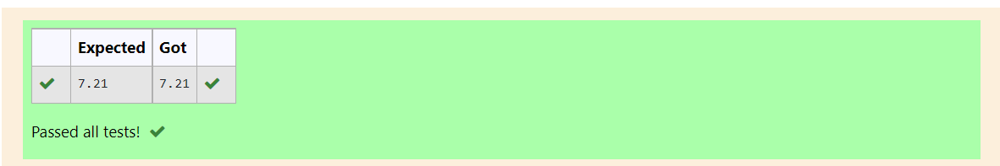

# DISTANCE-BETWEEN-TWO-POINTS

## AIM:
To write a python program to find the distance two 2 points
## ALGORITHM:
### Step 1: 
enter the function import math
### Step 2: 
enter the values
### Step 3: 
Substitute the values in the distance formula  
### Step 4: 
enter the function sqrt
### Step 5: 
print the program
### PROGRAM:
```
#Program to find the distance between two points.
#Developed by: joel p
#RegisterNumber:22008934
import math as m
l2=[10,6]
l1=[4,2]
d=m.sqrt((l2[0]-l1[0])**2+(l2[1]-l1[1])**2)
print("{:.2f}".format(d))
```  


### OUTPUT:


### RESULT:
thus the program is successfully executed
